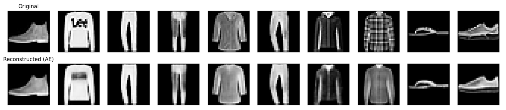
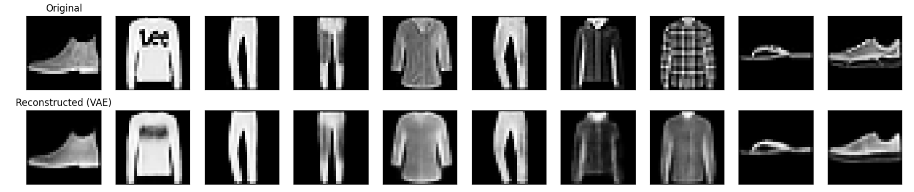
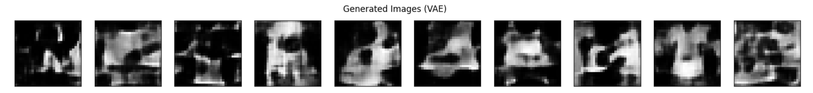
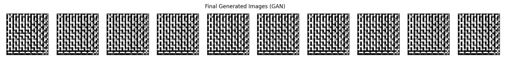

# Generative Models with AE, VAE, and GANs

## Project Description
This project demonstrates the implementation and comparison of three common generative models: Autoencoders (AE), Variational Autoencoders (VAE), and Generative Adversarial Networks (GAN). The models are trained on the Fashion-MNIST dataset to showcase their ability to reconstruct and generate images. The primary goal is to provide a clear, hands-on example of how these models work, their key differences, and their respective outputs.

## Repository Structure
```
/Generative-Models-AE-VAE-GAN
├── Generative_Models.ipynb
├── video_presentation.mp4
├── README.md
└── requirements.txt
```

## Installation Instructions

To set up the environment and run this project, follow these steps:

1.  **Clone the repository (or download the files):**
    ```bash
    git clone https://github.com/zoom100x/ae_vae_gan
    cd ae_vae_gan
    ```

2.  **Create a Python virtual environment (recommended):**
    ```bash
    python3 -m venv venv
    source venv/bin/activate  # On Windows use `venv\Scripts\activate`
    ```

3.  **Install the required packages:**
    The `requirements.txt` file lists all necessary Python libraries. Install them using pip:
    ```bash
    pip install -r requirements.txt
    ```
    The key libraries include:
    *   `tensorflow`: For building and training the neural network models.
    *   `matplotlib`: For plotting images and graphs.
    *   `numpy`: For numerical operations.
    *   `scikit-learn`: (Potentially for dataset utilities, though not explicitly in the current notebook code, it's good to have for ML tasks).
    *   `jupyter`: To run the .ipynb notebook.

## How to Run the Notebook

1.  **Activate your virtual environment** (if you created one):
    ```bash
    source venv/bin/activate
    ```

2.  **Start Jupyter Notebook or JupyterLab:**
    ```bash
    jupyter notebook
    ```
    or
    ```bash
    jupyter lab
    ```
    This will open a new tab in your web browser.

3.  **Open the notebook:**
    Navigate to the `Generative_Models.ipynb` file in the Jupyter interface and click on it to open.

4.  **Run the cells:**
    You can run the cells in the notebook sequentially by clicking the "Run" button or by pressing `Shift + Enter`.
The notebook includes explanations for each step, from data loading and preprocessing to model definition, training, and evaluation.

## Summary of Models and Theory References

This project implements and compares the following generative models:

### 1. Autoencoder (AE)
*   **Concept:** An AE is a type of neural network used for unsupervised learning of efficient codings. It consists of two parts: an encoder that compresses the input into a lower-dimensional latent space, and a decoder that reconstructs the input from this latent representation. AEs are primarily used for dimensionality reduction and feature learning.
*   **Theory References:**
    *   [Hinton, G. E., & Salakhutdinov, R. R. (2006). Reducing the dimensionality of data with neural networks. Science, 313(5786), 504-507.](https://www.science.org/doi/abs/10.1126/science.1127647)
    *   [Goodfellow, I., Bengio, Y., & Courville, A. (2016). Deep Learning. MIT Press. (Chapter 14)](https://www.deeplearningbook.org/contents/autoencoders.html)

### 2. Variational Autoencoder (VAE)
*   **Concept:** A VAE is a generative model that learns a probabilistic mapping from the input data to a latent space. Unlike standard AEs, VAEs impose a prior distribution (typically Gaussian) on the latent space, allowing for the generation of new data samples by sampling from this distribution and passing it through the decoder. They are known for producing a smooth and continuous latent space.
*   **Theory References:**
    *   [Kingma, D. P., & Welling, M. (2013). Auto-Encoding Variational Bayes. arXiv preprint arXiv:1312.6114.](https://arxiv.org/abs/1312.6114)
    *   [Doersch, C. (2016). Tutorial on Variational Autoencoders. arXiv preprint arXiv:1606.05908.](https://arxiv.org/abs/1606.05908)

### 3. Generative Adversarial Network (GAN)
*   **Concept:** GANs consist of two neural networks, a Generator and a Discriminator, that are trained simultaneously through a competitive process. The Generator tries to create realistic data samples (e.g., images) from random noise, while the Discriminator tries to distinguish between real data and the fake data produced by the Generator. Over time, the Generator learns to produce increasingly realistic samples.
*   **Theory References:**
    *   [Goodfellow, I. J., Pouget-Abadie, J., Mirza, M., Xu, B., Warde-Farley, D., Ozair, S., ... & Bengio, Y. (2014). Generative adversarial nets. Advances in neural information processing systems, 27.](https://papers.nips.cc/paper/2014/hash/5ca3e9b122f61f8f06494c97b1afccf3-Abstract.html)
    *   [Radford, A., Metz, L., & Chintala, S. (2015). Unsupervised Representation Learning with Deep Convolutional Generative Adversarial Networks. arXiv preprint arXiv:1511.06434. (DCGAN)](https://arxiv.org/abs/1511.06434)

## Screenshots of Generated Outputs

**Example Placeholder for AE Output:**

AE Original vs. Reconstructed Images


**Example Placeholder for VAE Output (Reconstruction & Generation):**

VAE Original vs. Reconstructed Images

VAE Generated Images


**Example Placeholder for GAN Output:**

GAN Generated Images at different epochs


## Link to Video Presentation

A video presentation summarizing the project, models, and results can be found here:

[Link to video_presentation.mp4]


